# Rock, Paper, Scissors

Rock, Paper, Scissors is a well known game around the world and is played by people of all ages, both for fun and occassionally for deciding who should have to do something as the winner
or loser. The game has been created on a webpage with the ability to play against the computer in the knowledge that the computer decides completely at random against the user.

[Live Webpage](https://harryrhayden.github.io/CI_PP2/)

1. [Project Goals](#project-goals)
    1. [User Goals](#user-goals)
    2. [Site Owner Goals](#site-owner-goals)
2. [User Experience](#user-experience)
    1. [Target Audience](#target-audience)
    2. [User Requirements and Expectations](#user-requirements-and-expectations)
    3. [User Stories](#user-stories)
3. [Style Choices](#style-choices)
    1. [Design](#design)
    2. [Colour](#colour-scheme)
    4. [Structure](#structure)
    5. [Initial Framework](#initial-framework)
4. [Technologies Used](#technologies-used)
    1. [Languages](#languages)
    2. [Frameworks & Tools](#frameworks-and-tools)
5. [Features](#features)
6. [Testing](#testing)
    1. [Manual Testing](#manual-testing)
    5. [Device testing](#perform-test-on-devices)
    6. [Browser compatibility](#browser-compatability)
    7. [Testing user and owner goals](#testing-user-and-owner-goals)
7. [Validation](#validator-testing)
    1. [HTML](#html)
    2. [CSS](#css)
    3. [Lighthouse](#lighthouse-score)
    4. [Accessibility](#accessibility)
    5. [JavaScript](#javascript)
8. [Bugs Fixed](#bugs-fixed)
9. [Deployment](#deployment)
10. [Credits](#credits)
    1. [Content](#content)
    2. [Media](#media)

## Project Goals

### User Goals

1. Ability to play a fun game
2. Ability to have a target number of victories for overall win
3. Ability to easily determine who won the round
4. Ability to try again once target score is reached
5. Ability to be shown the rules should they be needed

### Site Owner Goals

6. Provide a a fun stimulating game of Rock, Paper, Scissors
7. To provide a set of rules should they be required
8. Provide a dynamic scoreboard for the player
9. Provide an unbias computer player ensuring the selection is completely random
10. Provide the user buttons to input their selection

## User Experience

### Target Audience

- People who wish to play Rock, Paper, Scissors
- People looking to learn how to play Rock, Paper, Scissors
- People looking to while away a bit of downtime or boredom
- People who enjoy online games

### User Requirements and Expectations

- An easy to use game
- A fun experience with no cheating
- An understanding that the computer is randomised and not set to beat the player
- Presentation and visual aesthetics regardless of screensize
- Accessibility

### User Stories

- Provide a fun game for the user
- Provide a game of Rock, Paper, Scissors
- Provide a score counter to ensure the user can follow who is winning
- Provide an overall winner
- Provide the ability for the user to start the game over

## Style Choices

### Design
The design is a fun game of Rock, Paper, Scissors. A worldwide renowned game played by all ages. Sometimes just for fun and other times used as a tactic to make big decisions.
The game ensures the user is up against a randomised computer opponent providing feedback for the winner of each round and an overall winner.

### Colour Scheme

For the colour of the web page I used [Coolors](https://coolors.co/).

Colour Palette
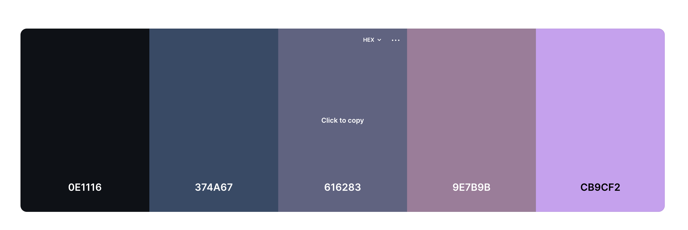

### Structure

### Initial Framework

Before starting the website I used a framework design tool called [Balsamic](https://balsamiq.com/) to mockup an initial design idea.

Index
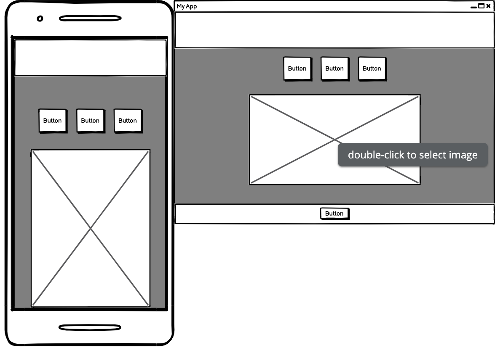

## Technologies Used

### Languages
- HTML
- CSS
- JavaScript

### Frameworks and Tools
- Git
- GitHub
- Gitpod
- Compressor.io
- Paint.NET
- Balsamiq
- Google Fonts
- Coolors
- Font Awesome
- Favicon.io

## Features
### Existing Features

- __Header__

  - Header provides the user the immediate expectation of the site - a game of Rock, Paper, Scissors
  - Goals covered : 1, 6

  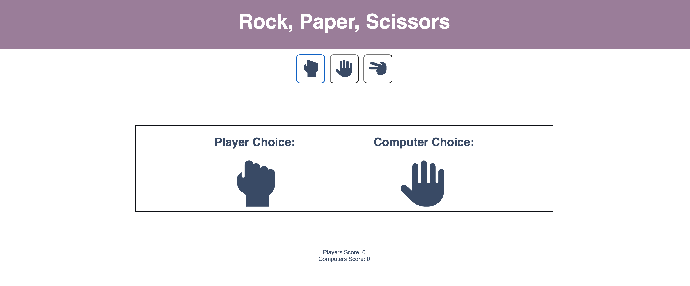

- __User Buttons__

  - A set of 3 buttons to allow the user to choose which symbol they wish to play the game with
  - Goals covered : 8, 9

  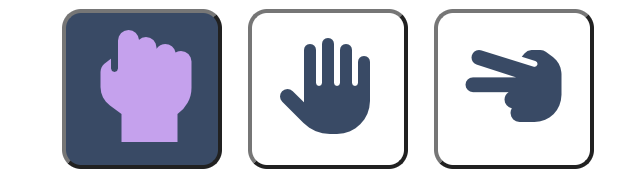

- __Game Area__

  - A dynamic game area showing both the users selection and the computers randomised choice
  - Responsive in design
  - Goals covered : 1, 6, 10

  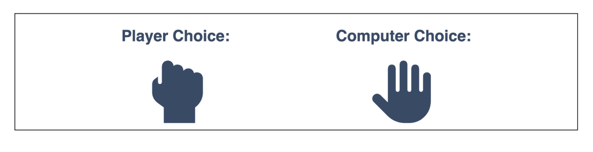

- __Score Card__

  - A reactive scorecard correctly keeping track of the score 
  - Each time a win is determined the correct score is updated
  - Goals covered : 3, 4, 8

  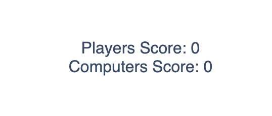

- __Rules Button__

  - A button which can be pressed to reveal the rules
  - Goals covered : 5, 7

  

- __Rules Popout__

  - A modal popout which has the rules displayed on
  - Goals covered : 5, 7

  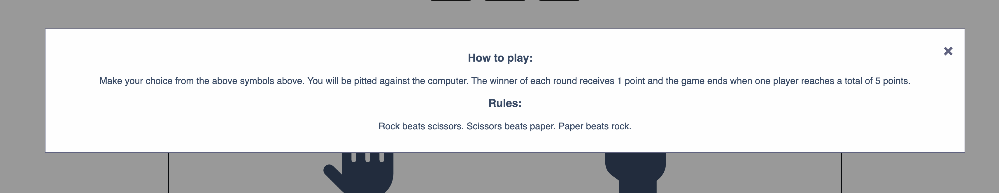

- __Round Winner Alert__

  - An alert shown to the user to provide the winner of the round
  - Goals covered : 3

  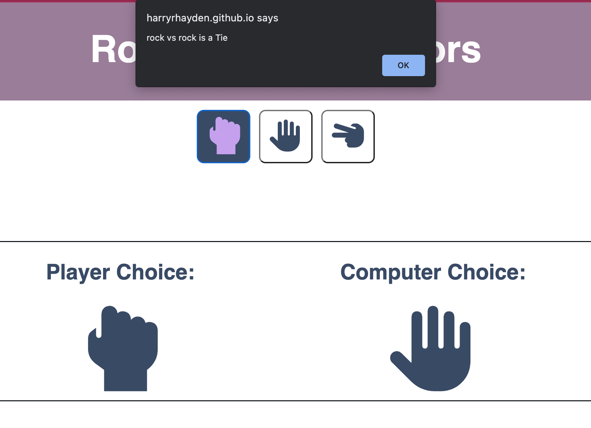

- __Winner Alert__

  - An alert shown to the user to provide the winner of the game
  - Goals covered : 3

  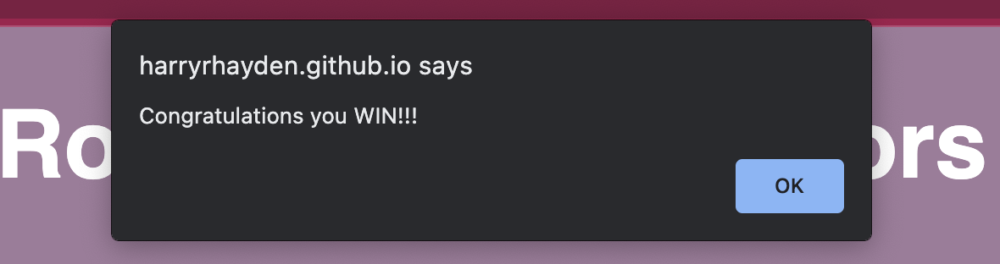

### Features Left to Implement

- Login to save wins/losses

## Testing 

### Perform test on devices
The website was tested on the following devices:
MacBook Pro
MacBook 
iPhone 11
iPhone 12 Mini
iPad

In addition, the website was tested using Google Chrome Developer Tools Device Toggling option for all available device options.

### Browser compatability
The website was tested on the following browsers:
Chrome
Safari
Edge

## Validator Testing 

### HTML
Validation completed by [W3S](https://validator.w3.org/#validate_by_input). This validator returned no errors for HTML.

  

Index
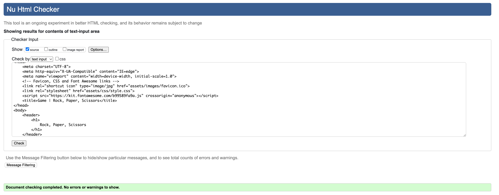
 

### CSS
Validation for CSS coding was completed by [W3S CSS Validator](https://jigsaw.w3.org/css-validator/) and returned no errors for my CSS coding.

  

CSS
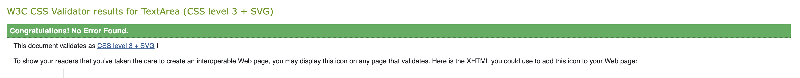
 
  
### Lighthouse Score
Lighthouse score was provided by Chrome Dev Tools and all scores were returned .

  

Lighthouse Score
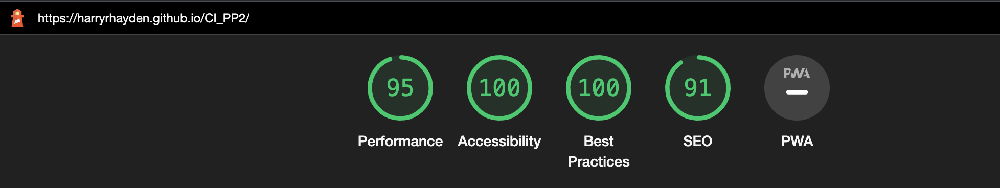
 

### Accessibility
Accessibility was tested using [Wave Webaim](https://wave.webaim.org/) and returned no errors.

Accessibility Index
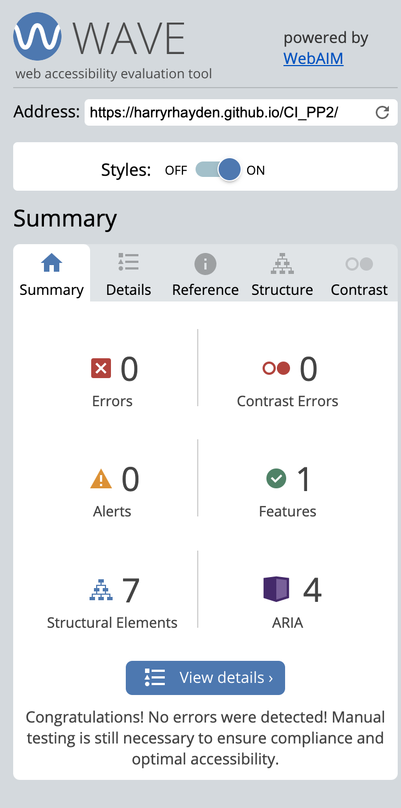
 

### JavaScript
JavaScript code was tested using [JSHint](https://jshint.com/) and returned one warning as shown below.

  

JavaScript Validation
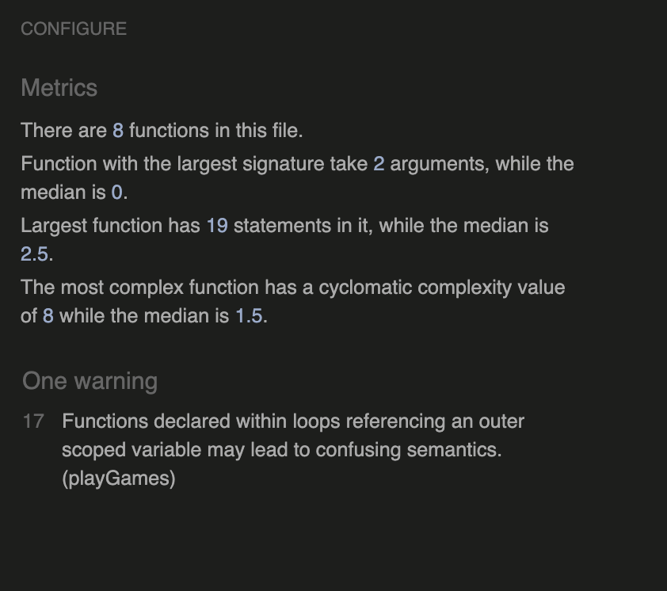
 

## Bugs Fixed

### Score Update

  * The winner was being announced but the score was not updating. - To fix I moved the calling of the score update function to inside the winner function. This solved the issue.

### Images not correct
  * The images to show the selections were not showing before the alert for the winner. - To fix I set a small delay on the alert so that the images updated.

### Duplicated ID attribute
  * Put the 'id' attribute into a div element twice

  

Double ID
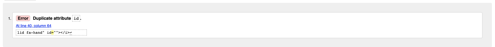
 

## Testing User and Owner Goals

1. Ability to play a fun game

| **Feature** | **Action** | **Expected Result** | **Actual Result** |
|-------------|------------|---------------------|-------------------|
| The game itself | Ability to play Rock, Paper, Scissors | Randomised game of Rock, Paper, Scissors against the computer | A playable game |

  

User Goal 1

 

2. Ability to have a target number of victories for overall win

| **Feature** | **Action** | **Expected Result** | **Actual Result** |
|-------------|------------|---------------------|-------------------|
| Scorecard | Ability to score the game of Rock, Paper, Scissors and show a winner | Score counter with an objective of reaching 5 | Winner announced when score of 5 acheived |

  

User Goal 2

 

3. Ability to easily determine who won the round

| **Feature** | **Action** | **Expected Result** | **Actual Result** |
|-------------|------------|---------------------|-------------------|
| Scorecard | An alert to show who wins the round | Scorecard to increment by 1 each time a winner is announced | Alert appears as expected and scorecard increments as expected |

  

User Goal 3

 

4. Ability to try again once target score is reached

| **Feature** | **Action** | **Expected Result** | **Actual Result** |
|-------------|------------|---------------------|-------------------|
| Scorecard resets | When winning score reached scores reset to play again | An alert to show who won the game and then score resets | An alert to show who won the game and then score resets |

  

User Goal 4

 
  

User Goal 4

 

5. Ability to be shown the rules should they be needed

| **Feature** | **Action** | **Expected Result** | **Actual Result** |
|-------------|------------|---------------------|-------------------|
| Rules modal popout | Ability to be shown the rules should they be needed | A popout which shows the rules | A seperate popout with the rules depicted |

  

User Goal 5

 
  

User Goal 5

 

6. Provide a a fun stimulating game of Rock, Paper, Scissors

| **Feature** | **Action** | **Expected Result** | **Actual Result** |
|-------------|------------|---------------------|-------------------|
| Rock, Paper, Scissors game | Allow user to play the game | A working version of Rock, Paper, Scissors | A functioning game |

  

User Goal 6

 

7. To provide a set of rules should they be required

| **Feature** | **Action** | **Expected Result** | **Actual Result** |
|-------------|------------|---------------------|-------------------|
| Rock, Paper, Scissors rules modal | Allow user to read the rules of the game | A modal popout with the rules on | A modal popout with the rules on |

  

Owner's Goal 6

 
  

Owner's Goal 6

 

8. Provide a dynamic scoreboard for the player

| **Feature** | **Action** | **Expected Result** | **Actual Result** |
|-------------|------------|---------------------|-------------------|
| Scores area | Scores area that is updated each round | After a winner is declared the score count increases accordingly | A scoring area which updates after each round |

  

Owner's Goal 8

 

9. Provide an unbias computer player ensuring the selection is completely random

| **Feature** | **Action** | **Expected Result** | **Actual Result** |
|-------------|------------|---------------------|-------------------|
| Games area | Randomised computer selection | Each time the game is run the computers choice will be randomised | A random result for the computers pick each time |

  

Owner's Goal 8

 

10. Provide the user buttons to input their selection

| **Feature** | **Action** | **Expected Result** | **Actual Result** |
|-------------|------------|---------------------|-------------------|
| Buttons section | 3 buttons to allow the user to select their choice | Each button represents one of the Rock, Paper, Scissors choices and when pressed shows the selection | Selection shown as expected |

  

Owner's Goal 8

 

## Deployment

The website was deployed using GitHub Pages by following these steps:
1. On the GitHub repository select the Settings tab
2. Using the left hand sub-menu select Pages
3. When asked for the source select Branch: master
4. After the webpage refreshes automaticaly you will be shown a ribbon along the top saying: "Your site is published at https://harryrhayden.github.io/CI_PP2/"

You can for fork the repository by following these steps:
1. Go to the GitHub repository
2. Click on Fork button in upper right hand corner

You can clone the repository by following these steps:
1. Go to the GitHub repository 
2. Locate the Code button above the list of files and click it 
3. Select if you prefer to clone using HTTPS, SSH, or Github CLI and click the copy button to copy the URL to your clipboard
4. Open Git Bash
5. Change the current working directory to the one where you want the cloned directory
6. Type git clone and paste the URL from the clipboard ($ git clone https://github.com/YOUR-USERNAME/YOUR-REPOSITORY)
7. Press the Enter key to create your local clone.

The live link can be found here - https://harryrhayden.github.io/CI_PP2/

## Credits 

### Content 

- The icons in the game area were taken from [Font Awesome](https://fontawesome.com/)
- The images were compressed using [Compressor IO](https://compressor.io/)

### Media

- The colours used on the site are found on [Coolors](https://coolors.co/)
- The favicon came from [Favicon](https://favicon.io/)